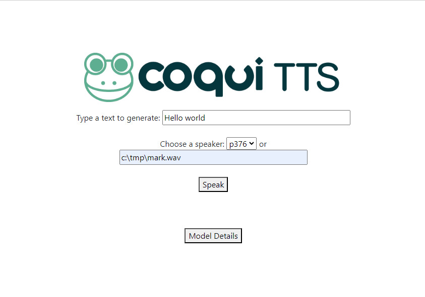

This is a fork of https://github.com/coqui-ai/TTS

______________________________________________________________________

<div align="center">

</div>

______________________________________________________________________

## Description
This adds an improved server.py, where you can refer to a local wav file for voice cloning either running XTTS or Vits.


## Installation

To run this, you must clone from this repo and install TTS from here as it changes some of the code related to the server

```bash
git clone https://github.com/diegomeire/TTS
pip install -e .  # Select the relevant extras
```


## Running


### XTTS server 
#### using CPU
```
cd /TTS/server
python server.py --model_name="tts_models/multilingual/multi-dataset/xtts_v2" --model_path="/Users/diegomeire//Library/Application Support/tts/tts_models--multilingual--multi-dataset--xtts_v2" --config_path="/Users/diegomeire//Library/Application Support/tts/tts_models--multilingual--multi-dataset--xtts_v2/config.json" --show_details=True  --use_cuda=False
```
#### using GPU
```
cd /TTS/server
python server.py --model_name="tts_models/multilingual/multi-dataset/xtts_v2" --model_path="/Users/diegomeire//Library/Application Support/tts/tts_models--multilingual--multi-dataset--xtts_v2" --config_path="/Users/diegomeire//Library/Application Support/tts/tts_models--multilingual--multi-dataset--xtts_v2/config.json" --show_details=True  --use_cuda=True
```

### XTTS server 
#### using CPU
```
cd /TTS/server
python server.py --model_name="tts_models/en/vctk/vits" --show_details=True --use_cuda=False
```
#### using GPU
```
cd /TTS/server
python server.py --model_name="tts_models/en/vctk/vits" --show_details=True --use_cuda=True
```


______________________________________________________________________
Please refer to the original repository for more information
